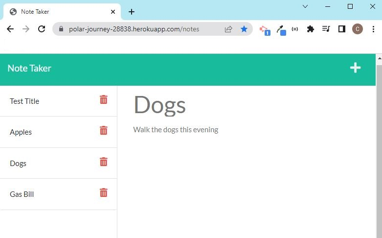

# Note Taker Express.js
  

  ## Description
  
  - This is my first homework assignment hosting my first server on the internet for the Full Stack Web Developer course I'm enrolled in. 
  - The homework assignment was to modify front end started code for an application that lets a user write, save and delete personal notes. In order for the application to work correctly, it was my job to build the back end, connect the front end, and deploy the entire application to Heroku.
  - By completing this assignment, I was able to implement lessons from my course, including: Use an Express.js back end, Implement a modular router in my code to respond to client requests, Use FS.js to create, append and delete files, and finally create a simple database for data persistence.

  
  The following is a screenshot of the final version of webpage hosted on Heroku. 

    
   
  ## Table of Contents
   
  - [Installation](#installation)
  - [Usage](#usage)
  - [Credits](#credits)
  - [License](#license)
  - [How To Contribute](#how_to_contribute)
  - [Tests](#tests)
  - [Questions](#questions)
  
  ## Installation
  
  N/A

  
  ## Usage
  
   - Here is the link to the [Note Taker](https://polar-journey-28838.herokuapp.com/notes) webpage. 
   - To view the back end code for this application, visit my [GitHub Repo](https://github.com/CM-GDev/NoteTakerExpressJS) 
    
  ## Credits

  This homework assignment had a BONUS task to add the capability to delete notes in the application. To fulfill this function for the application, I incorporated the following articles on the subject to my final code.

  -[StackOverflow Express.js delete request](https://stackoverflow.com/questions/61526572/express-js-delete-request)   
  -[Tabnine Express.delete](https://www.tabnine.com/code/javascript/functions/express/Express/delete);

  ## License
  
  MIT License

  Copyright (c) [2022] [Cristobal Marquez-Glynn]
  
  ## How to Contribute
  
  - [Contributor Covenant](https://www.contributor-covenant.org/) 
  - I'm open to suggestions on how to improve this product.
  
  ## Tests
  
  N/A
  
  ## Questions
   
  For any questions, you can reach me through my [GITHUB](https://github.com/CM-GDev) or email: cristobalmqz@gmail.com account. 
